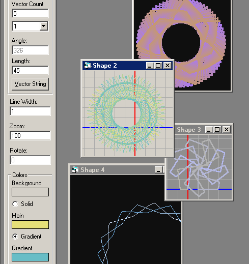



## Advanced Shape Generator 3\.0

### Description

Three projects are included in this archive. The first is an ActiveX DLL update of the advanced shape generator. What this class does is takes a series of vectors (such as 36 at 54º) and sequences through them, then repeats itself as many times as it takes until the process closes on itself. A byproduct of this operation is an enclosed shape, where the beginning point meets the end point. All enclosed shapes can be created in this manner, which I call "Vector Sequencing".

The second project allows you to do just that. It is a test application which allows you to experiment with different properties of the csShape, and provides a decent example on how to use the csShape class in code.

The third project included is a screen saver which uses the csShape class to create random shapes and changing colors. It is a fine example of how to create a complete screen saver that uses password, docks itself into a screen (providing you provide correct command line arguments), and more.

Have fun with this 3-in-one givaway. It was alot of work, and I hope you find it interesting.
 
### More Info
 

             |
---                |---
**Submitted On**   |2001-07-04 02:26:08
**By**             |[Jon Feucht](https://github.com/Planet-Source-Code/PSCIndex/blob/master/ByAuthor/jon-feucht.md)
**Level**          |Advanced
**User Rating**    |5.0 (50 globes from 10 users)
**Compatibility**  |VB 5\.0
**Category**       |[Graphics](https://github.com/Planet-Source-Code/PSCIndex/blob/master/ByCategory/graphics__1-46.md)
**World**          |[Visual Basic](https://github.com/Planet-Source-Code/PSCIndex/blob/master/ByWorld/visual-basic.md)
**Archive File**   |[Advanced S22185742001\.zip](https://github.com/Planet-Source-Code/jon-feucht-advanced-shape-generator-3-0__1-24713/archive/master.zip)

